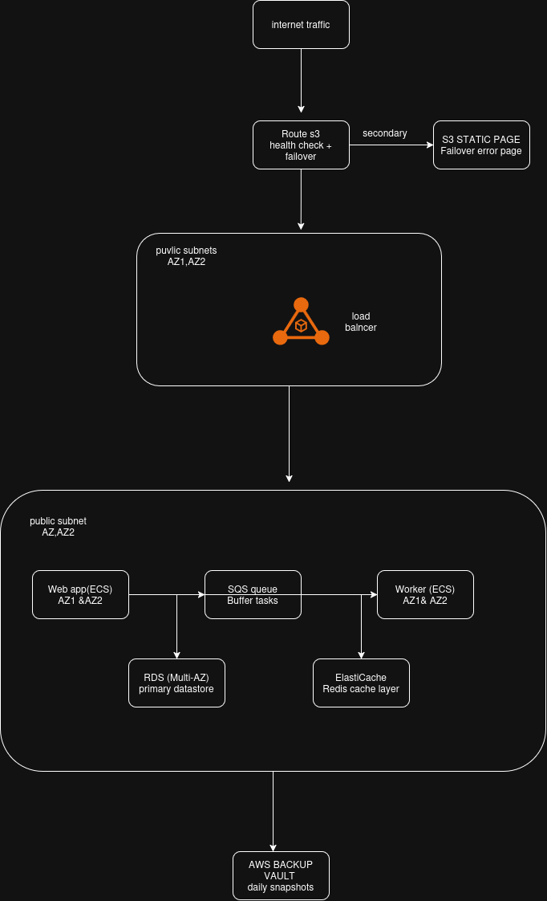
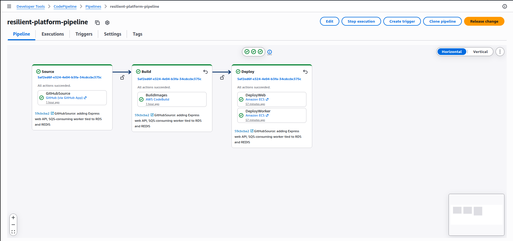

# Resilient Container Platform & CI/CD

A containerized e-commerce platform on Amazon ECS Fargate, built to survive Availability Zone failures and unpredictable traffic spikes — deployed entirely as code, with automated CI/CD, disaster recovery, and horizontal scaling driven by real traffic and queue depth rather than manual intervention.

**Stack:** ECS Fargate · RDS MySQL (Multi-AZ) · ElastiCache Redis · SQS · Route 53 · AWS Backup · CodePipeline/CodeBuild · CloudFormation · Node.js/Express

---

## Table of contents

- [Architecture](#architecture)
- [Repository structure](#repository-structure)
- [Deployment](#deployment)
- [CI/CD proof](#cicd-proof)
- [Scaling proof](#scaling-proof)
- [Disaster recovery runbook & failover proof](#disaster-recovery-runbook--failover-proof)
- [Local testing](#local-testing)
- [Key learnings](#key-learnings)

---

## Architecture




**Traffic flow:** Internet → Route 53 (health-checked failover) → Application Load Balancer (2 AZs) → ECS Fargate web service (2 AZs) → RDS MySQL Multi-AZ + ElastiCache Redis (cache-aside reads). The web tier pushes order-processing tasks to SQS; a separate ECS Fargate worker service consumes them asynchronously and writes results back to RDS.

**Resilience by design:**

| Decision | Why it matters |
|---|---|
| Compute + data span 2 AZs | No single-AZ dependency anywhere in the request path |
| One NAT Gateway per AZ (not shared) | A NAT failure in one AZ doesn't kill the other AZ's outbound connectivity |
| RDS Multi-AZ | Synchronous standby promotes automatically on primary failure |
| ElastiCache as a Redis **replication group** | Primary + replica with automatic failover, not a single point of failure |
| Web and worker scale on different signals | ALB request count for web, SQS queue depth for worker — a backlog of async work can't starve the user-facing tier, and vice versa |

## Repository structure

```
app/
  web/       Express API — order creation (writes to RDS, enqueues to SQS), cached reads via Redis
  worker/    SQS consumer — processes order tasks, writes results to RDS, invalidates cache
infrastructure/
  network.yaml     VPC, public/private subnets across 2 AZs, NAT gateways
  data.yaml        RDS MySQL Multi-AZ, ElastiCache Redis replication group
  messaging.yaml   SQS queue + dead-letter queue
  compute.yaml     ECS cluster, ALB, web/worker services, target-tracking scaling policies
  dr.yaml          AWS Backup plan, Route 53 failover (private hosted zone), S3 static failover page
  pipeline.yaml    CodePipeline, CodeBuild, ECR repositories
pipeline/
  buildspec.yml    Builds both container images, pushes to ECR, emits ECS image definitions
README.md
```

## Deployment

Each stack exports values the next one imports — deploy strictly in this order:

```bash
aws cloudformation deploy --template-file infrastructure/network.yaml    --stack-name resilient-platform-network    --capabilities CAPABILITY_NAMED_IAM
aws cloudformation deploy --template-file infrastructure/data.yaml       --stack-name resilient-platform-data        --capabilities CAPABILITY_NAMED_IAM
aws cloudformation deploy --template-file infrastructure/messaging.yaml  --stack-name resilient-platform-messaging   --capabilities CAPABILITY_NAMED_IAM
aws cloudformation deploy --template-file infrastructure/compute.yaml    --stack-name resilient-platform-compute     --capabilities CAPABILITY_NAMED_IAM
aws cloudformation deploy --template-file infrastructure/dr.yaml         --stack-name resilient-platform-dr          --capabilities CAPABILITY_NAMED_IAM
aws cloudformation deploy --template-file infrastructure/pipeline.yaml   --stack-name resilient-platform-pipeline    --capabilities CAPABILITY_NAMED_IAM \
  --parameter-overrides GitHubOwner=<owner> GitHubRepo=<repo>
```

After the pipeline stack deploys, authorize the GitHub connection once in the console: **CodePipeline → Settings → Connections → Update pending connection**. This is a one-time manual step AWS requires for every CodeStar connection.

## CI/CD proof

CodePipeline sources from GitHub via CodeStar Connections, builds both the web and worker images with CodeBuild, pushes them to two separate ECR repositories, and deploys via two parallel ECS rolling-update actions — one per service.



```
+---------+-------------+
|  stage  |   status    |
+---------+-------------+
|  Source |  Succeeded  |
|  Build  |  Succeeded  |
|  Deploy |  Succeeded  |
+---------+-------------+
```

## Scaling proof

- **Web service** scales on `ALBRequestCountPerTarget` (target: 100 requests/target), min 2 / max 6 tasks.
- **Worker service** scales on SQS `ApproximateNumberOfMessagesVisible` (target: 10 messages), min 1 / max 6 tasks.


*Captured by generating sustained load against the web tier and a backlog of orders against the worker tier, then screenshotting CloudWatch task-count metrics rising alongside ALB request count / SQS queue depth.*

## Disaster recovery runbook & failover proof

**Backup:** AWS Backup takes a daily snapshot of the RDS instance (`cron(0 5 * * ? *)`), retained for 35 days, via a dedicated backup vault and IAM role.

**Failover:** A Route 53 health check polls the ALB every 30 seconds over HTTP. While healthy, `app.resilient-platform.internal` (private hosted zone — no public domain registered for this demo) resolves to the ALB via a `PRIMARY` failover record. After 3 consecutive failed checks, Route 53 automatically switches to a `SECONDARY` record aliased to a static "service unavailable" page hosted on S3 — no manual intervention required.

**Runbook — simulating and confirming failover:**
```bash
# 1. Break it
aws ecs update-service --cluster resilient-platform-cluster --service resilient-platform-web --desired-count 0

# 2. Watch the health check flip (poll every ~30s, needs 3 consecutive failures)
aws route53 get-health-check-status --health-check-id <id>

# 3. Restore
aws ecs update-service --cluster resilient-platform-cluster --service resilient-platform-web --desired-count 2

# 4. Confirm recovery
aws elbv2 describe-target-health --target-group-arn <web-target-group-arn>
```

**Before (healthy, all checker regions):**
```json
{
  "Region": "ap-southeast-2",
  "StatusReport": {
    "Status": "Success: HTTP Status Code 200, OK. Resolved IP: 3.131.60.30"
  }
}
```

**After (web service scaled to 0):**
```json
{
  "Region": "ap-southeast-2",
  "StatusReport": {
    "Status": "Failure: HTTP Status Code 503, Service Temporarily Unavailable. Resolved IP: 3.131.60.30"
  }
}
```

Recovery was confirmed by re-checking ALB target health after restoring `desired-count` — both targets returned to `healthy`, split across both Availability Zones.

## Local testing

```bash
curl http://<alb-dns-name>/                              # health check

curl -X POST http://<alb-dns-name>/orders \
  -H "Content-Type: application/json" \
  -d '{"item": "widget", "quantity": 3}'                 # create an order (writes RDS, enqueues SQS)

curl http://<alb-dns-name>/orders                         # list orders (Redis cache-aside)
```

## Key learnings

**The scenario:** modernize a mission-critical e-commerce platform by moving it into containers, while making it survive both infrastructure failure (an AZ going down) and unpredictable load (traffic spikes) — and ship changes through an automated pipeline instead of manual deploys.

- **A successful deploy doesn't mean the system works.** Every CloudFormation stack showed `CREATE_COMPLETE` the whole way through, but the worker service silently did nothing for hours. The root cause wasn't a deploy failure — it was a placeholder `sleep 3600` command left in the container definition from before real app code existed. CodePipeline's ECS deploy action only patches the image URI, not the rest of the container definition, so the placeholder silently survived every subsequent deploy. Scaffolding config needs an explicit removal step, not an assumption that a later deploy will overwrite it.

- **Absence of errors can itself be the bug.** No crash logs, no stopped tasks, `runningCount` matching `desiredCount` — every signal said "healthy." The actual debugging breakthrough was noticing what *should* have been there and wasn't (zero log bytes ever written, despite a log statement on the very first line of the process) rather than chasing an error message that never appeared.

- **"Multi-AZ" is a series of individual decisions, not one setting.** Two AZs for subnets, two NAT Gateways instead of one shared, RDS Multi-AZ, a Redis *replication group* with automatic failover rather than a single cache node, independent scaling policies per tier. Any one of these done incorrectly looks fine right up until the specific failure mode it protects against actually happens.

- **DR only counts once you've actually broken something on purpose.** The Route 53 failover configuration looked correct from the YAML alone. Real proof required deliberately scaling the web service to zero, watching the health check flip from `200 OK` to `503` across every checker region, and confirming a clean restore afterward. Config review is not the same as failure testing.

- **Scope and cost tradeoffs are worth stating explicitly.** This project uses a private Route 53 hosted zone (proven via health-check status and target-group health rather than a public browser test) instead of registering a throwaway domain — a deliberate tradeoff for a demo project, not an oversight.

- **CLI/terminal friction produced real bugs of its own** — a flattened line-continuation backslash, a single mistyped character in a JMESPath query, a browser defaulting to HTTPS against an HTTP-only listener. None were infrastructure bugs, but each cost real debugging time before the actual cause became clear.